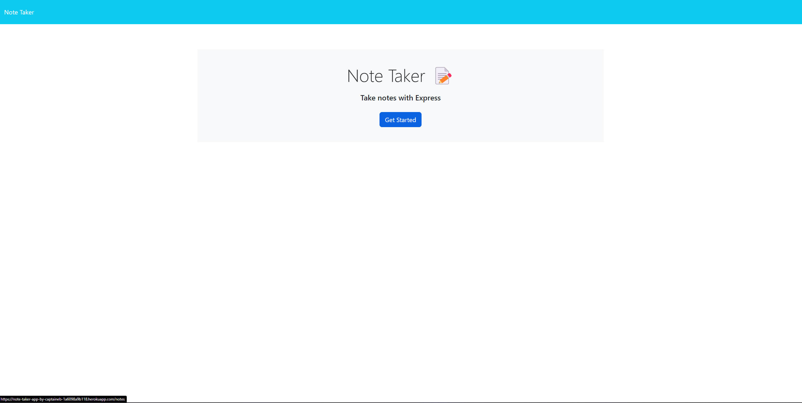
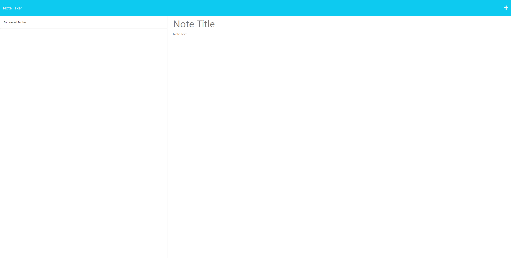
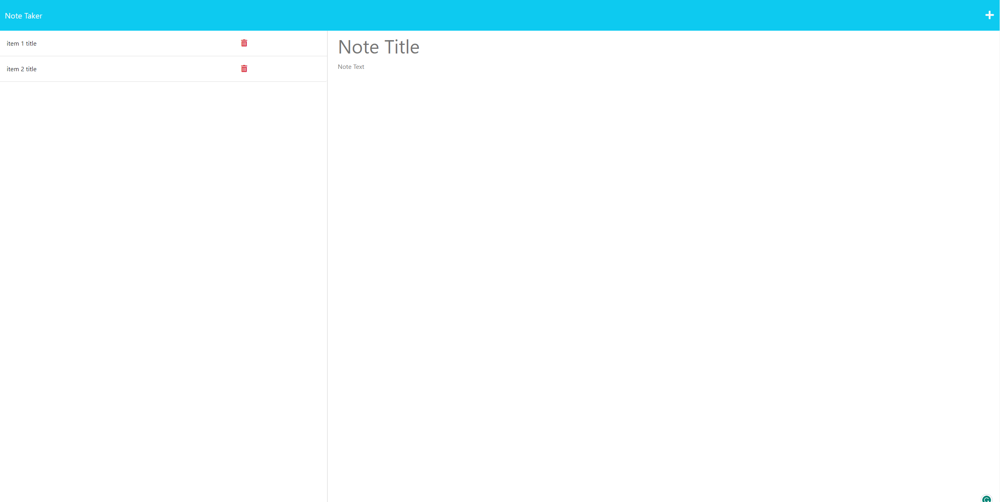
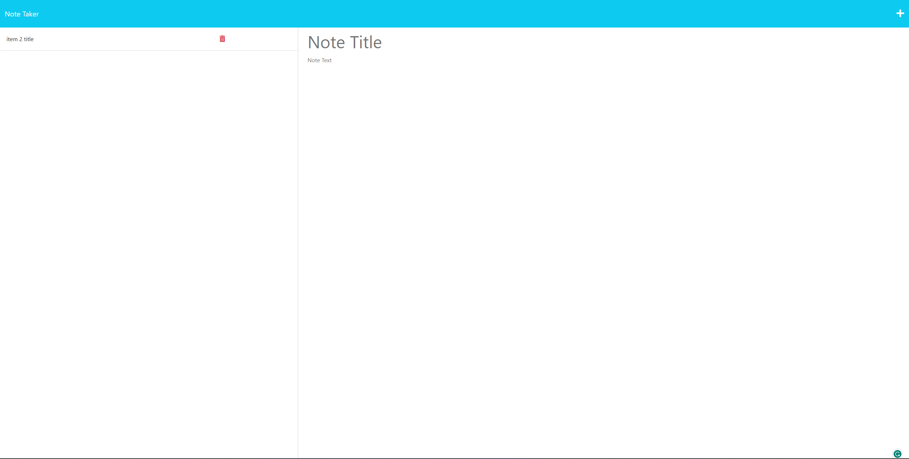

# Note Taker App by Sam

This note taking app helps you stay organized by writing down your daily tasks.
The app let's you write down a title and a description for the task at hand.
This app saves the tasks to a file and keeps them there until you remove them by clicking on the trash icon.

Live URL: https://note-taker-app-by-captaineb-1a6098a9b118.herokuapp.com/

Screenshots:
## 

## 

## 

## 

The front end code was provided by UCI and the backend code was written by Sam Ebadi Sobi